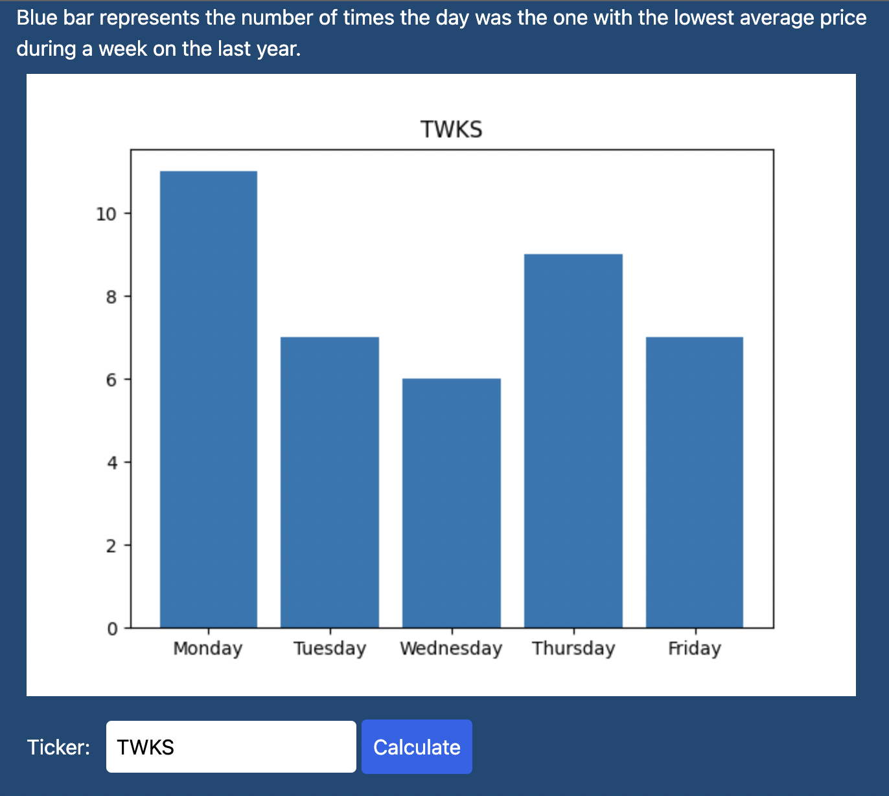

# XDCA

This is a simple project to showcase the current status of [PyScript](https://pyscript.net/) by building a toy fullstack Python application.

It is deployed on  [Deta Cloud](https://www.deta.sh/) at <https://xdca.deta.dev/>

Contains a small FastAPI backend to avoid having CORS errors when calling Yahoo Finance.

I added as much code as it makes sense to [index.html](pyscript/index.html) to showcase how you can run plain Python code thanks to PyScript.

Check the page source and you will see mostly Python code and no javascript at all!

> Disclaimer: The calculation shown there is just an example and could be easily wrong.
